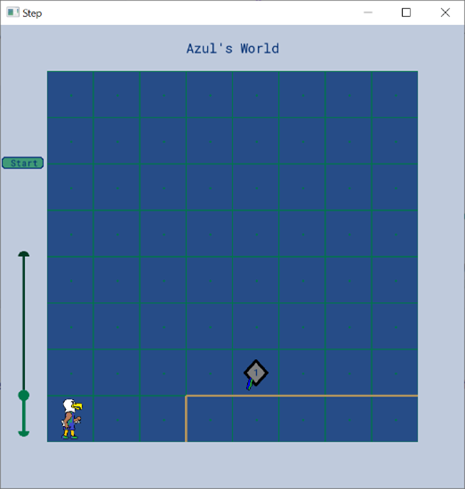
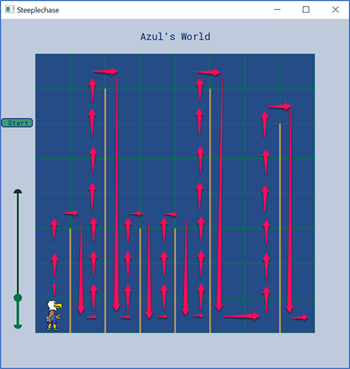

# Azul’s World
*A Custom Programming Environment for Introductory C++ Courses*

**Repository:** https://github.com/pallenfgcu/Azul.git

Azul’s World is a custom, visual programming environment designed to support introductory programming courses (Programming I, Programming II, Data Structures). Students write **C++ programs** to control Azul, FGCU’s mascot, as he navigates grid-based worlds with walls, obstacles, and collectible items.

The environment is intentionally visual and constrained, helping students practice sequencing, control flow, and problem decomposition while working in a real development environment (CMake, compiler, IDE).

---

## What is Azul’s World?

Azul’s World is a grid-based environment composed of rows and columns. Each cell may have walls on its borders, and Azul can move between cells subject to these constraints. The outer boundary of the world acts as walls. Azul can also pick up and place graduation caps in the world.

Students interact with the environment through a small API exposed by the `fgcu::Azul` class. Programs written by students control Azul’s movement and interactions, with immediate visual feedback in the windowed environment.

---

## Example Environments (Visual Overview)

These images illustrate the type of environments students program against. Detailed instructions for each scenario are provided separately in course materials.

### Step (Introductory Scenario)
<p align="center">
  
</p>

### Steeplechase (Obstacle Navigation)
<p align="center">
  
</p>

---

## Getting Started

This repository is intended to be cloned as a starting point for Azul programming exercises. The project uses **CMake** and will automatically download and build required dependencies (AzulLib and SFML) the first time you configure the project.

Clone URL (used by all IDEs below):

```
https://github.com/pallenfgcu/Azul.git
```

Choose the instructions below for your development environment.

---

### CLion

1. Open CLion.
2. Select **Get from VCS**.
3. Paste: `https://github.com/pallenfgcu/Azul.git`
4. Choose a local directory and click **Clone**.
5. CLion will automatically configure CMake and download dependencies.
6. Build and run the default project to verify your setup.

---

### Microsoft Visual Studio (Windows)

1. Open Visual Studio 2022.
2. Select **File → Clone Repository**.
3. Paste: `https://github.com/pallenfgcu/Azul.git`
4. Choose a local folder and click **Clone**.
5. Visual Studio will detect the CMake project and configure it automatically.
6. Select a configuration (e.g., **x64-Debug**) and build/run.

---

### Visual Studio Code (VS Code)

1. Install VS Code.
2. Install the **C/C++** and **CMake Tools** extensions.
3. Clone the repo:
   ```bash
   git clone https://github.com/pallenfgcu/Azul.git
   ```
4. Open the project folder in VS Code.
5. When prompted, allow CMake Tools to configure the project.
6. Select a compiler kit if prompted, then build/run.

> VS Code relies on extensions for CMake integration. Ensure CMake is installed and available on your system PATH.

---

## API Documentation

This project includes generated documentation for the Azul API.

To explore the available methods on the `fgcu::Azul` class:

- Open `doc/html/index.html` in your web browser.

These docs describe the public interface students use when writing their programs.

---

## What You Should (and Should Not) Modify

**You will typically modify:**
- `src/main.cpp` (or a renamed version of this file for each exercise)

**You generally should not modify:**
- `CMakeLists.txt`
- Files related to AzulLib or third-party dependencies
- Files in `doc/` (API documentation)

---

## Notes

- The first build may take several minutes while dependencies are downloaded and compiled.
- Always close the Azul window using the window’s **X** button so the program can clean up properly.
- Detailed, step-by-step exercise instructions are provided separately by your instructor.

---

## Versioning

This project is versioned and depends on **AzulLib**.  
Please refer to the repository **tags/releases** to identify the version associated with your course offering.

---

## Repository Layout (Quick Reference)

```
Azul/
├── .github/
├── doc/               # API documentation (open doc/html/index.html)
├── images/            # Screenshots used in this README
├── src/
│   └── main.cpp       # Starting point for student programs
├── .gitignore
├── CMakeLists.txt
├── LICENSE.md
└── README.md
```
